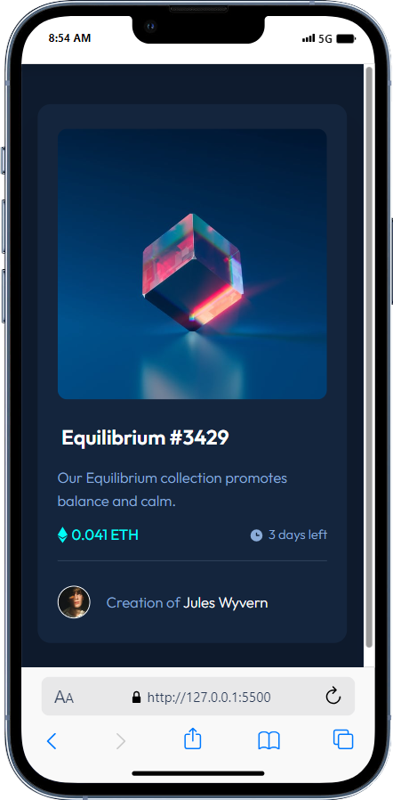
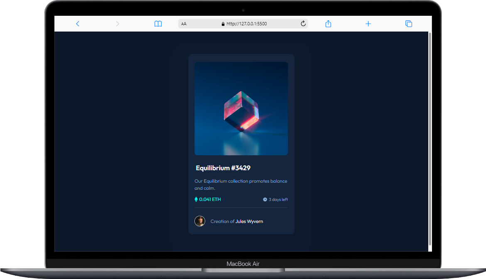

# Frontend Mentor - NFT preview card component solution

This is a solution to the [NFT preview card component challenge on Frontend Mentor](https://www.frontendmentor.io/challenges/nft-preview-card-component-SbdUL_w0U). Frontend Mentor challenges help you improve your coding skills by building realistic projects.

## Table of contents

- [Overview](#overview)
  - [The challenge](#the-challenge)
  - [Screenshot](#screenshot)
  - [Links](#links)
- [My process](#my-process)
  - [Built with](#built-with)
  - [What I learned](#what-i-learned)
  - [Continued development](#continued-development)
- [Author](#author)

## Overview

### The challenge

Users should be able to:

- View the optimal layout depending on their device's screen size
- See hover states for interactive elements

### Screenshot

| Mobile                         | Desktop                          |
| ------------------------------ | -------------------------------- |
|  |  |
|                                |                                  |

<p align="center">
  
</p>
### Links

- Solution URL: [solution](https://github.com/asmaahamid02/nft-preview-card-component)
- Live Site URL: [live site](https://asmaahamid02.github.io/nft-preview-card-component/)

## My process

### Built with

- Semantic HTML5 markup
- CSS custom properties
- Flexbox
- CSS Grid
- Mobile-first workflow

### What I learned

It was an easy challenge, yet I learned a little bit how to use multiple box shadows.

```css
.proud-of-this-css {
  box-shadow: 0 1.5em 0.5em 1em hsla(217, 54%, 11%, 0.6), 0 20px 0.5em 3em hsla(216, 50%, 16%, 0.2);
}
```

### Continued development

I used a div for the overlay, I think I should have used a pseudo element instead. I want to learn more about pseudo elements and how to use them.

## Author

- Website - [Asmaa Hamid](https://linktr.ee/asmaahamid02)
- Frontend Mentor - [@asmaahamid02](https://www.frontendmentor.io/profile/asmaahamid02)

